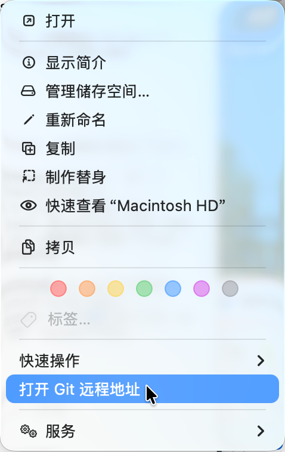

# `JobsGitRemoteOpener`


[toc]

---

## 🔥 <font id=前言>前言</font>



`JobsGitRemoteOpener` 是一个 [**Swift**](https://www.swift.org/) macOS App + Finder Sync Extension 工程，用来把“打开 Git 远程地址”放到 Finder 右键一级菜单区域。

## 一、适用场景 <a href="#前言" style="font-size:17px; color:green;"><b>🔼</b></a> <a href="#🔚" style="font-size:17px; color:green;"><b>🔽</b></a>

- 在 Finder 中右键一个 Git 仓库文件夹或仓库子目录。
- 通过系统默认浏览器打开仓库 `remote` 对应网页。
- 支持常见地址：

  | remote 形式 | 打开结果 |
  | --- | --- |
  | `https://github.com/org/repo.git` | `https://github.com/org/repo` |
  | `git@github.com:org/repo.git` | `https://github.com/org/repo` |
  | `ssh://git@gitlab.com/org/repo.git` | `https://gitlab.com/org/repo` |
  | `git@ssh.dev.azure.com:v3/org/project/repo` | `https://dev.azure.com/org/project/_git/repo` |

## 二、环境先决条件 <a href="#前言" style="font-size:17px; color:green;"><b>🔼</b></a> <a href="#🔚" style="font-size:17px; color:green;"><b>🔽</b></a>

| 检查项 | 要求 | 说明 |
| --- | --- | --- |
| 系统版本 | macOS `12.0` 及以上 | 工程 `MACOSX_DEPLOYMENT_TARGET` 为 `12.0`，功能依赖 Finder Sync Extension。 |
| 开发工具 | [**Xcode**](https://developer.apple.com/xcode) + `xcodebuild` | 手动运行用 Xcode；根目录批量安装脚本会调用 `xcodebuild` 构建主 App 和扩展。 |
| Finder 扩展 | 系统设置中启用 `打开 Git 远程地址` | 构建阶段会注册并尝试启用扩展；如果菜单未出现，先确认系统设置里的 Finder 扩展开关。 |
| Git 仓库结构 | 目标目录存在可解析的 `.git` 信息 | 支持普通仓库、子模块和 worktree；扩展直接读取 `.git/config`，不依赖 `/usr/bin/git`。 |
| 默认浏览器 | 系统默认浏览器可打开网页 | 点击菜单后会把 remote 地址转成网页地址并交给 macOS 默认浏览器打开。 |

建议运行前先做基础自检：

```shell
xcode-select -p
xcodebuild -version
pluginkit -m -p com.apple.FinderSync -A -v | grep JobsGitRemote
```

## 三、运行方式 <a href="#前言" style="font-size:17px; color:green;"><b>🔼</b></a> <a href="#🔚" style="font-size:17px; color:green;"><b>🔽</b></a>

1. 用 [**Xcode**](https://developer.apple.com/xcode) 打开 `JobsGitRemoteOpener.xcodeproj`。
2. 选择 `JobsGitRemoteOpener` Scheme，直接运行主 App。
3. Xcode 构建阶段会自动注册并启用 `com.jobs.JobsGitRemoteOpener.FinderSyncExtension`，成功后会重启 Finder 刷新右键菜单缓存。
4. 回到 Finder，右键 Git 仓库文件夹，点击 `打开 Git 远程地址`。
5. 首次重新安装后，构建阶段可能会等待几十秒，用来等 `pluginkit` 从空状态异步登记到可启用状态。

## 四、实现边界 <a href="#前言" style="font-size:17px; color:green;"><b>🔼</b></a> <a href="#🔚" style="font-size:17px; color:green;"><b>🔽</b></a>

- Finder Sync Extension 可以进入 Finder 右键一级菜单区域，但最终位置由 macOS 决定，不能保证排在系统菜单项前面。
- 扩展默认监控 `/`，用于覆盖 Finder 中任意位置的文件夹右键菜单。
- 扩展不调用 `/usr/bin/git`，直接读取 `.git/config`，减少终端环境依赖。
- 支持普通仓库、子模块、worktree 这类 `.git` 文件指向真实 Git 目录的结构。
- Finder Sync Extension 保留 App Sandbox；本机自用版通过 `com.apple.security.temporary-exception.files.absolute-path.read-only` 给 `/` 增加只读例外，否则菜单可以出现，但点击后读取仓库 `.git/config` 会被 macOS 沙盒拦截。

## 五、排查说明 <a href="#前言" style="font-size:17px; color:green;"><b>🔼</b></a> <a href="#🔚" style="font-size:17px; color:green;"><b>🔽</b></a>

- 右键菜单未出现：
  - 确认 `JobsGitRemoteFinderSync.entitlements` 保留了 `com.apple.security.app-sandbox`；Finder Sync Extension 去掉 sandbox 后可能无法被 `pluginkit` 登记出来。
  - 确认系统设置中 Finder 扩展已经启用，或点击 App 内的 `重新启用扩展`。
  - 重新打开 Finder 窗口。
  - 重新编译后构建阶段会重新启用扩展，并自动重启 Finder。
  - 也可以执行下面命令确认扩展已启用，输出行前面有 `+` 表示启用：

    ```shell
    pluginkit -m -p com.apple.FinderSync -A -v | grep JobsGitRemote
    ```

  - 如果已经注册但没有 `+`，执行下面命令启用：

    ```shell
    pluginkit -e use -i com.jobs.JobsGitRemoteOpener.FinderSyncExtension
    ```

- 点击后没有打开浏览器：
  - 确认 `JobsGitRemoteFinderSync.entitlements` 保留了 `com.apple.security.app-sandbox`。
  - 确认 `JobsGitRemoteFinderSync.entitlements` 里有 `com.apple.security.temporary-exception.files.absolute-path.read-only`，并包含 `/`。
  - 确认仓库存在 `remote`。
  - 优先读取当前分支 upstream remote，其次读取 `origin`，最后读取第一个 remote。
  - 暂不处理需要额外登录或自定义跳转规则的私有 Git 服务。

- 查看扩展调试日志：

  ```shell
  log stream --predicate 'process == "JobsGitRemoteFinderSync"' --style compact
  ```

  ```shell
  tail -n 200 "$HOME/Library/Containers/com.jobs.JobsGitRemoteOpener.FinderSyncExtension/Data/Library/Application Support/JobsGitRemoteFinderSync/FinderSync.log"
  ```

<a id="🔚" href="#前言" style="font-size:17px; color:green; font-weight:bold;">我是有底线的➤点我回到首页</a>
